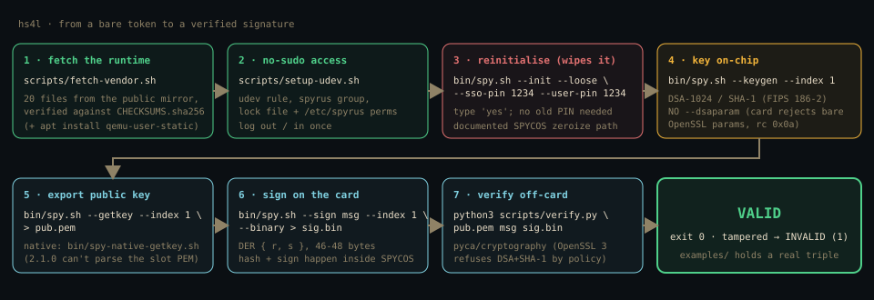
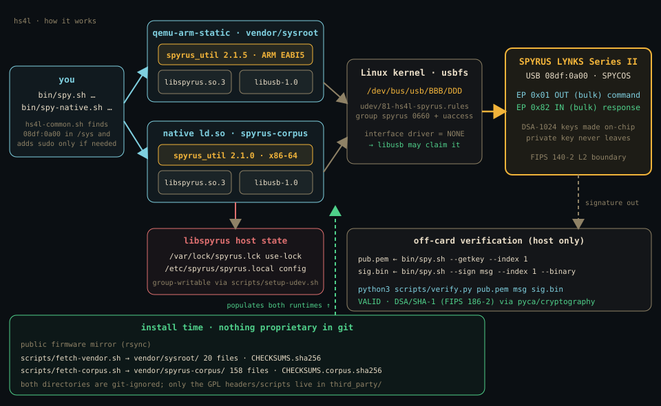
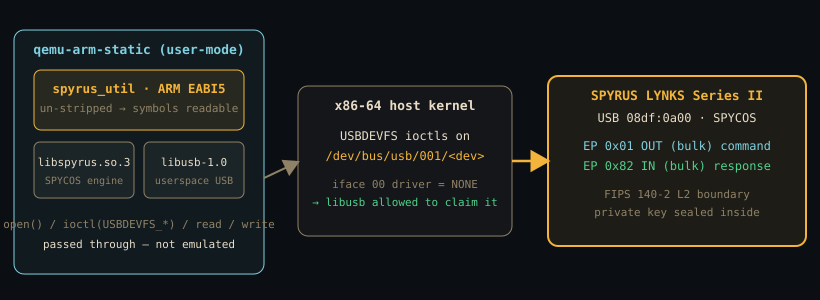
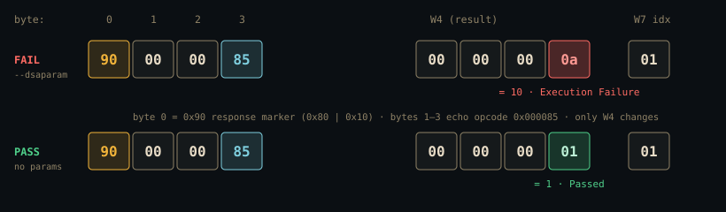
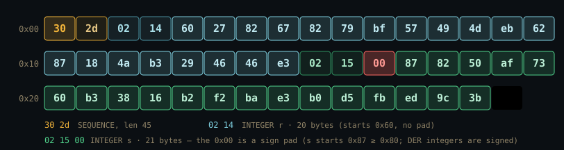
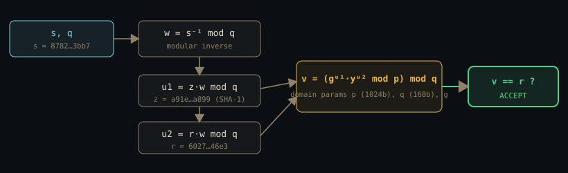

# hs4l — HSM-SPYRUS-4-Linux

**Drive an orphaned SPYRUS LYNKS Series II hardware security module from
Linux — no Windows, no vendor middleware, no known PIN.** Reinitialise it,
generate keys on-chip, sign, and verify, using the manufacturer's own ARM
firmware run under `qemu-arm-static` against the raw USB pipe via `libusb`.

> SPYRUS is defunct (absorbed by Route1 in 2021). There is no Linux driver
> and the Windows middleware is gone from the public web. The one thing that
> still works turned out to be a **seismograph vendor's firmware**: its
> Platinum digitiser rootfs ships an ARM Linux tool, `spyrus_util`, that
> speaks the undocumented
> SPYCOS protocol. hs4l wraps it so it runs on any Linux box.

| | |
|---|---|
| Device | SPYRUS LYNKS Series II · USB `08df:0a00` · part `3003-F0` ©2005 |
| Validation | FIPS 140-2 Level 2 · NIST CMVP #679 · OS: SPYCOS |
| Crypto | on-chip DSA-1024 / SHA-1 (FIPS 186-2); slot 9 = EC |
| Proven | keygen · sign · verify · CSR · reinitialise-from-scratch |
| Host tested | x86-64 Fedora + `qemu-arm-static` + `libusb` |

## ⚠️ Read first: the vendor binaries are not in this repo

`spyrus_util` and `libspyrus` are **SPYRUS / firmware-vendor proprietary** and are **not
redistributed here**. `scripts/fetch-vendor.sh` pulls them from the vendor's
**public** rsync mirror and checksums them. See
**[VENDOR-NOTICE.md](VENDOR-NOTICE.md)**. Everything original in this repo
(wrappers, docs, diagrams, examples) is BSD-3-Clause.

## Supported devices

hs4l drives whatever `libspyrus` drives. The library opens the token either
over raw USB (`libusb`, vendor ID `08df`) or through the PCMCIA driver's
`/dev/spyrus0` node, so the same commands apply to both form factors.

| Device | Interface | Status |
|---|---|---|
| **SPYRUS LYNKS Series II, USB** ("Spyrus Inc" / "Lynks USB Interface", `08df:0a00`, part `3003-F0`) | USB, `libusb` | **Verified** — every step in this README was run on a real unit (serial `01:00:00:00:f0:00:18:4f`, firmware SPYCOS) |
| Other LYNKS Series II USB units | USB, `libusb` | Expected to work: same USB ID, same firmware family; untested — reports welcome |
| SPYRUS LYNKS Series II PC Card (PCMCIA/CardBus) | `spyrus_cs.ko` → `/dev/spyrus0` | Supported by `libspyrus`, **untested**. The GPL driver (`pcmcia:0244:0300`) is only published as `.ko` for the vendor's 2.6.31/2.6.36 kernels; a modern host needs its source, obtainable from the vendor under the GPL |
| SPYRUS Rosetta (Series II/III smart cards and USB), Hydra PC, WorkSafe / Secure Pocket Drive | PKCS#11 / CCID / mass storage | **Not covered** — different protocols, nothing here talks to them |
| Other Fortezza-family PC cards | PCMCIA | Unknown; `spyrus_cs.ko` binds only to `0244:0300` |

Hosts: verified on x86-64 Fedora, both under `qemu-arm-static` (`bin/spy.sh`)
and natively with the x86-64 build (`bin/spy-native.sh`). Any Linux with
`qemu-user-static` should run the ARM build (aarch64 boards included);
untested. If you have a unit that is not in this table, open an issue with
the output of `lsusb -v -d 08df:` and `bin/spy.sh --status -D`.

## Quickstart

```sh
git clone https://github.com/borjatarraso/hs4l && cd hs4l
scripts/fetch-vendor.sh            # populate vendor/sysroot/ + verify checksums
scripts/setup-udev.sh              # run without sudo: udev rule, spyrus group, lock + /etc/spyrus
sudo apt install qemu-user-static  # or your distro's equivalent

bin/spy.sh --status                # talk to the card (read-only)
```

`bin/spy.sh` runs unprivileged when the token's USB node, `/var/lock/spyrus.lck`
and `/etc/spyrus` are all writable by you — which is what `setup-udev.sh` sets
up (log out and back in for the new group). Otherwise it falls back to `sudo`
with a one-line notice. `HS4L_SUDO=1` forces sudo; `HS4L_SUDO=0` forbids it.

Reinitialise and use it from scratch:

```sh
bin/spy.sh --init --loose --sso-pin 1234 --user-pin 1234   # wipes it; type 'yes'
bin/spy.sh --keygen --index 1                              # NO --dsaparam, NO --pin
bin/spy.sh --getkey --index 1 > pub.pem
printf 'hello from the LYNKS' > msg
bin/spy.sh --sign msg --index 1 --binary > sig.bin
python3 scripts/verify.py pub.pem msg sig.bin             # VALID
```

`bin/spy.sh --help` prints the wrapper's own environment variables
(`HS4L_SYSROOT`, `HS4L_SUDO`, `HS4L_MIRROR`) and then `spyrus_util`'s usage;
every other flag goes straight through to the vendor tool.

Full walkthrough: **[docs/REINITIALIZE.md](docs/REINITIALIZE.md)**.



## How it works



The token's USB interface is vendor-specific with **no kernel driver**, so
`libusb` claims it from userspace. `spyrus_util` is a 32-bit ARM binary that
links `libusb` (not a kernel module), so running it under `qemu-arm-static` —
which forwards syscalls straight to the host kernel — lets its USB I/O reach
the real device node unchanged.



### The one real bug: `Execution Failure`

Every `--keygen` returned result code `0x0a` (Execution Failure) — but the
full command/response round-trip completed each time, so it was never a
transport problem. The card is **FIPS 186-2 only: L = 1024, N = 160**.
OpenSSL 3 emits a **224-bit q** for 1024-bit DSA parameters, and `libspyrus`
writes the Q block as a fixed 20 bytes, so the card received a truncated q
that does not divide p−1 and refused. **Fix: don't pass `--dsaparam` (the
card self-generates), or generate with `-pkeyopt qbits:160`.** Only word 4
of the response differs between fail and pass:



Details: **[docs/PROTOCOL.md](docs/PROTOCOL.md)** ·
**[docs/TROUBLESHOOTING.md](docs/TROUBLESHOOTING.md)**.

## The signature, byte for byte

The card returns a textbook DSS signature — ASN.1 `SEQUENCE { INTEGER r,
INTEGER s }`, 47 bytes. `r` starts `0x60` (20 bytes, no pad); `s` starts
`0x87` so DER prepends a `0x00` sign pad (21 bytes):



Verify with the public key alone (a one-byte change is rejected):



`scripts/verify.py` needs nothing beyond the Python standard library: it
parses the PEM/DER public key and the signature itself and does the FIPS
186-4 verification arithmetic, so no library's SHA-1/DSA deprecation policy
gets a vote. It takes the signature either DER-encoded (as `--sign --binary`
writes it) or as raw `r || s` (40 bytes), auto-detected (`--format der|raw`
forces one). Exit status: **0** valid, **1** invalid, **2** usage or
malformed/unreadable input. `python3 scripts/verify.py --self-test` checks
the arithmetic against the known-answer vector the card produced for
`examples/`.

`examples/` holds a real `pubkey.pem`, `msg.txt`, `sig.bin` you can verify
now, plus `dsaparam.pem.rejected` (224-bit q, draws `0x0a`) and
`dsaparam-1024-160.pem.accepted` (160-bit q, accepted) with the key and
signature the card produced from it (`pubkey-slot2.pem`, `sig-slot2.bin`).

## Layout

```
bin/spy.sh              wrapper: spyrus_util under qemu-user + libusb
bin/spy-native.sh       same CLI on the x86-64 CMG-NAM64 build, no qemu
bin/spy-native-getkey.sh  public-key export for the native build (see below)
bin/hs4l-common.sh      shared helper: run unprivileged or fall back to sudo
scripts/fetch-vendor.sh fetch vendor/sysroot from the public firmware mirror
scripts/fetch-corpus.sh fetch the whole SPYRUS firmware corpus (all 7 platforms)
scripts/verify.py       off-card SHA-1 DSA verify, standard library only (--self-test)
scripts/setup-udev.sh   udev rule + spyrus group + lock file / /etc/spyrus perms
udev/                   the udev rule
Makefile                make fetch / setup / status / verify / test / check
tests/                  unittest suite for verify.py (make test)
.github/                device-report issue template
docs/                   PROTOCOL · REINITIALIZE · TROUBLESHOOTING · CORPUS-INDEX + diagrams/
examples/               real pubkey / message / signature + rejected params
third_party/spyrus-gpl/ GPL-licensed vendor headers + scripts, with provenance
CHECKSUMS.sha256        SHA-256 of the 20 vendor files these docs target
CHECKSUMS.corpus.sha256 SHA-256 of the 158-file corpus fetch-corpus.sh mirrors
VENDOR-NOTICE.md        what is not shipped, and why
```

## Requirements

`qemu-user-static` (`qemu-arm-static`), `rsync`, Python 3.9+ (standard library only),
`libusb` on the host, and a SPYRUS LYNKS Series II on USB.

## Tests

```sh
make test     # shellcheck (when installed) + verify.py --self-test + python3 -m unittest discover -s tests
make check    # make test + the example triple + vendor/sysroot checksum verify
```

Nothing in the test suite touches a token: it exercises the DSA arithmetic on
a fixed 1024/160 key, the DER/raw signature and PEM/DER key decoders, and the
verifier's exit-status contract.

## Legality

This operates a device **you physically own and are entitled to use**. The
reinitialise path is a **documented** SPYCOS function; hs4l extracts no key
material and bypasses no authentication. See VENDOR-NOTICE.md.

## License

BSD-3-Clause for the original work here (see [LICENSE](LICENSE)). Vendor
binaries are not included and remain the property of their owners.

## Native x86-64 build (no qemu) and the wider SPYRUS firmware corpus

The vendor's open rsync server also carries an **x86-64** Platinum platform
(`CMG-NAM64`) whose `spyrus_util` 2.1.0 is unstripped, has debug info, and
runs directly on a 64-bit PC with its own loader and libraries:

```sh
scripts/fetch-corpus.sh          # mirrors every SPYRUS file for all 7 platforms + NAM64 lib closure
bin/spy-native.sh --status       # same CLI as bin/spy.sh, no qemu-user needed
```

The native build is **2.1.0**; the ARM build behind `bin/spy.sh` is **2.1.5**.
One known difference: on 2.1.0, `--getkey --index N` fails with
`spyrus_get_key: Unable to unpack PEM` / `Failed to find public key` (exit 1,
silent without `-D`) for keys generated by 2.1.5, whose slot holds a
CRLF-terminated PEM. `bin/spy-native-getkey.sh [index] > pub.pem` rebuilds the
PEM from the hexdump that `--get --index N` prints and yields the identical
key. Every read-only query (`--state`, `--status`, `--list`, `--time`, `--get`)
works natively.

`fetch-corpus.sh` populates `vendor/spyrus-corpus/` (git-ignored) and
verifies it against [`CHECKSUMS.corpus.sha256`](CHECKSUMS.corpus.sha256) (158
files, paths relative to the corpus root); what each file is lives in
[`docs/CORPUS-INDEX.md`](docs/CORPUS-INDEX.md). Besides the binaries it brings the
GPL-2 C headers — `spyrus.h`, `spyrus_dss.h` and, from the older `CMG-DCM-mk4`
SDK, `spyrus_int.h` with every card opcode and wire struct — the GPL
`spyrus_cs.ko` PCMCIA driver for the card-slot LYNKS, the vendor's udev rule,
init script, first-boot provisioning script and web-UI CGI. The
`libspyrus`/`spyrus-utils` *source* is not on the vendor's open-source page or
rsync (the builder module is access-restricted and their git host no longer
resolves); the library is GPL-2, so the source is obtainable from the vendor on
request.

`libspyrus` keeps a use-lock at `/var/lock/spyrus.lck` and its config
(`spyrus.local`) in `/etc/spyrus/`, and needs write access to both.
`scripts/setup-udev.sh` makes them group-writable for `spyrus` (a tmpfiles.d
entry recreates the lock at boot) and fixes files left root-owned by an earlier
sudo run; both wrappers otherwise fall back to `sudo` (`HS4L_SUDO=0` forbids
that). Granting your user an ACL on both paths still works too.

## GPL source parts included

`third_party/spyrus-gpl/` carries the parts of the vendor's spyrus-utils package
that are distributed as source under an explicit GPL notice: the `libspyrus`
public headers, the 2008 internal header with the full card command set, and
the two provisioning scripts. Provenance, checksums and per-file licence are in
`third_party/spyrus-gpl/README.md`. Binaries stay out of the repo.
